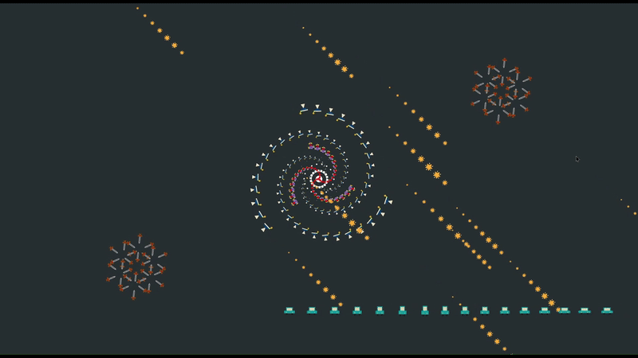

# CSE4170 - Introduction to Computer Graphics  
## HW2: 2D Modeling Transformations Using OpenGL API

---

## 1. Environment

- **OS**: Windows 11 64-bit  
- **CPU**: 11th Gen Intel(R) Core(TM) i5-1135G7  
- **GPU**: NVIDIA GeForce MX450  
- **Compiler**: Visual Studio 2022 (Release x64)  
- **OpenGL**: Core Profile  

---

## 2. Implementation Summary

This project implements creative and complex **2D affine transformations** using OpenGL API functions. The following elements have been designed and animated according to the assignment requirements.

---

### (a) Galaxy Scene (5 objects)

#### 1. Shirt
- **Effect**: Rotates around the origin in grouped sets, each with different radius and scale.
- **Location**: White objects rotating at the center (galaxy core).

#### 2. Cocktail
- **Effect**: Spirals out from the center and disappears by reverting to previous position for a tail illusion.
- **Location**: 3 long tails of the galaxy.

#### 3. Airplane
- **Effect**: Spirals into the center and appears again by reverting position for a continuous tail illusion.
- **Location**: 3 short tails of the galaxy.

#### 4. Sword (Snowflake Sword)
- **Effect**: 6 swords oscillate with time lag, arranged symmetrically like snowflakes.
- **Location**: Symmetric snowflake shapes in 1st and 3rd quadrants.

#### 5. Car (Pudding-like Moving Car)
- **Effect**: x and y scaling change independently over time with a lag to simulate a "pudding bounce" effect, moving horizontally.
- **Location**: Moves from bottom-right to left and repeats.

---

### (b) Modeled Object: Shooting Star

- **Model**: Star  
- **Effect**: Stars pulse like a heartbeat and fall diagonally (45°) with depth illusion by varying pixel offset and scaling. Randomized position and depth.
- **Location**: Randomly appearing falling stars across the screen.

---

## 3. Notable Techniques (Bonus Criteria)

- Time-staggered transformations to create illusion of motion (e.g., galaxy tails, sword symmetry, falling stars).
- Pixel-level motion control for fine-grained animation (shooting star).
- Independent axis scaling to simulate dynamic "squash and stretch" effects (pudding-like car).

---

## 4. Build & Run Instructions

1. Open the `.sln` file in **Visual Studio 2022**.
2. Set the configuration to `Release x64`.
3. Build the solution and run the program.

> Ensure OpenGL (Core Profile) libraries are properly linked before building.

---

## 5. File List

- `main.cpp` — Entry point with rendering loop  
- `transform.cpp` — Affine transformation logic  
- `object.cpp` — Object drawing and modeling  
- `utils.hpp/cpp` — Utility functions (time, math, etc.)  
- `README.md` — This documentation  
- `.gitignore` — Visual Studio & OS-specific ignores  
- `resources/` — (Optional) Image or data assets  

---

## 6. Screenshots / Demo Video (Optional)

*(Include GIFs or screenshots here to visually demonstrate your animations.)*

---

## 7. License

This project was completed as part of the Sogang University [CSE4170] course and is submitted for educational purposes only.

